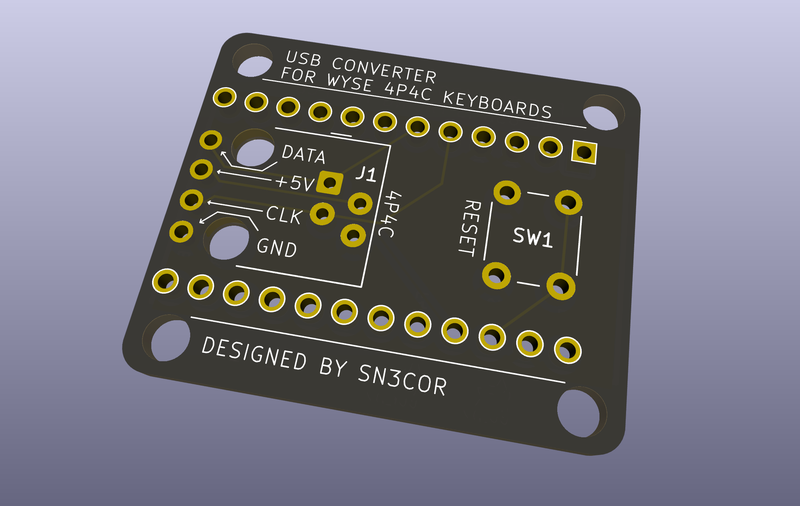
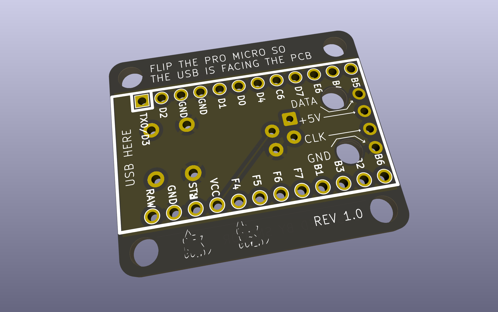

# wyse-mod
This project makes converting Wyse keyboards (with 4P4C connector) easier to test, with the end goal of functioning as a standalone converter box. It is designed to work with [Soarer's Wyse conversion software](https://geekhack.org/index.php?topic=52597.0). I'll be trying to create something similar soon (to be at least compatible with Wyse PCE Keyboard).

Huge thanks to [ErkHal](https://github.com/ErkHal) and their [Pohola Work's project](https://github.com/pohjolaworks/wyse-converter) for sparking the idea for this project.

# Overview
The PCB features dedicated pads to solder wires straight from the keyboards connector pins for easy testing.

A Pro Micro microcontroller is mounted on the bottom of the board, with components facing the PCB. Also using a socket for an MCU is highly recommended. After veryfing that your Wyse keyboard works with the firmware, simply solder a 4P4C connector and plug in an old RJ9/RJ10/RJ22 (afaik they are all the same) roll-over (crossed) cable.

## Frontside

## Backside

# Parts List
- the PCB
- Pro Micro like board (with ATmega32U4) 
- Hotswap sockets for the Pro Micro
- 4P4C connector
- RJ9/RJ10/RJ22 cable
- 6x6 button (optional, but makes flashing software easier)
- 4xM3 screws (TODO after designing a case)

# TODO
- [x] Design a PCB [Rev 1.0 is being tested]
- [ ] Design a case
- [ ] Try to write own conversion software

# Sources and helpful links
- [Soarer's geekhack thread](https://geekhack.org/index.php?topic=51079.msg1127174#msg1127174)(some of the images aren't rendering so [here is an archived version](https://web.archive.org/web/20230822022830/https://geekhack.org/index.php?topic=51079.0))
- [Soarer's deskthority thread](https://deskthority.net/viewtopic.php?t=7424)
- [A guide for Pro Micro conversion with Soarer's](https://jorts.tech/projects/promicro-soarers-guide)(contains a thorough guide for the Soarer's mod and mentions other useful sources)
